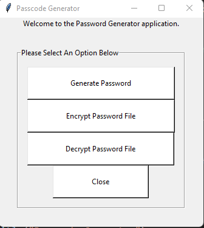
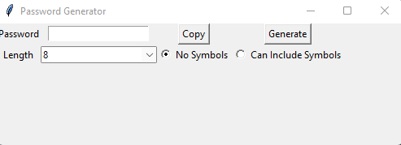
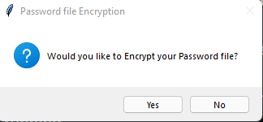
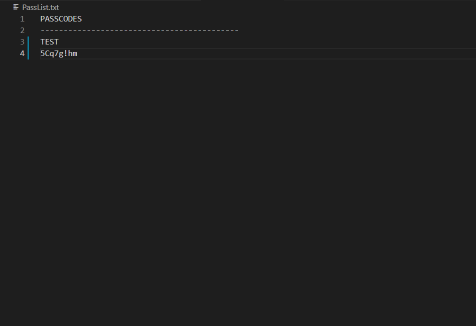
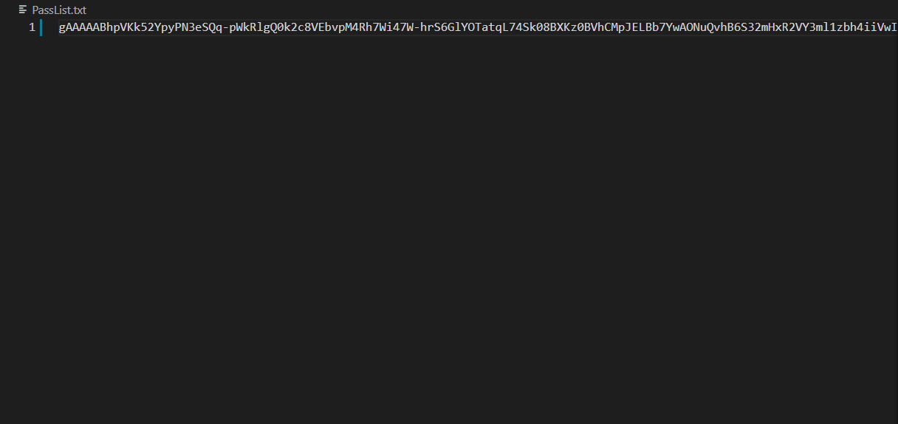
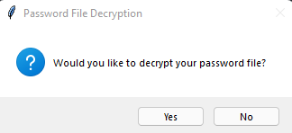

<h1> Passcode Generator Application </h1>
<b>
Welcome to the Passcode Generator Application.  
With this application, you will be able to generate a passcode for any application that you need and store it in a secure txt file that only you will be able to access.  
This is a all in one GUI interface for generating, storing, and securing your passwords.
</b>

<h2> How To Install The Project  </h2>
<b>
First, Copy and paste the code into your preferred Python IDE so that you are able to run it. You will need python version 3.9.9 to run this script.   
Once you have pasted the code into your preferred IDE, you will then need to install the proper modules to run this application. 
</b>
First you will need install the modules below.  
 

pip install cryptography
 
pip install Fernet
 
pip install pyperclip
 

Once done, Please restart your session so Python can see the newly installed modules.
 
The other modules used in this application should already be pre-intalled with python so you wont need to install them.
 
Once you have the required modules installed, run the code and a windows like the one below should pop-up.
 

 
Once you have first ran the program and you get the window above to open, please close the program. This needs to be done since this script will generate your password file in the directory that you ran the program in. The program needs to be closed so the file can be saved so the next time you run the program, you will be able to save passwords to the file along with being able to encrypt and decrypt the file. A file named "PassList.txt" should have been created within your current directory.
 
Now you are free to use the program the way it was designed to be used. If you click the "Generate Password" Button, A window like the one below will open.
 

 
With this window, you will be able to generate a complex password. You will be able to select the length from 8-12 and the strength of the password, whether you want it to include symbols or not. You will also be able to copy this password to your clipboard to be able to paste it into your PassList.txt file.
 
Next, if you want to keep your password file secure, you will be able to encrypt that file using this application.
 
Click the "Encrypt Password File" button on the home screen and a yes or no window will pop up asking if you want to encrypt your password file. Below is images of the pop up and the file before and after you have encrypted it.
 

 
<h3>Before Encryption</h3>

 
<h3>After Encryption</h3>

As you can see, this is a good way to keep your password safe!
 
Next, you will want to access your password at some point and to do that just press the "Decrypt Password File" button and a window will open and ask if you want to decrypt your password file. See images Below.
 

 
<h3>Before Decryption</h3>

 
<h3>After Decryption</h3>

 
Once you are done with the application, you can press close to close out of the app.
 
That is all!

